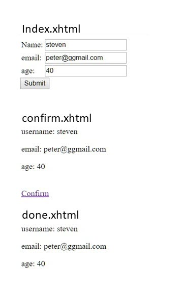

# Null Pointer exception occurs when using the flash scoped value as the f:param value

2018/4/25

## Codes to replicate the exception

`index.xhtml`

```markup
<?xml version='1.0' encoding='UTF-8' ?>
<!DOCTYPE html PUBLIC "-//W3C//DTD XHTML 1.0 Transitional//EN" "http://www.w3.org/TR/xhtml1/DTD/xhtml1-transitional.dtd">
<html xmlns="http://www.w3.org/1999/xhtml"
      xmlns:h="http://xmlns.jcp.org/jsf/html"
      xmlns:f="http://xmlns.jcp.org/jsf/core">
    <h:head>
        <title>index</title>
    </h:head>
    <h:body>
        <h:form>
            <h:panelGrid columns="2">
                <h:outputLabel for="username"  >Name: </h:outputLabel>
                <h:inputText id="username" value="#{flash.username}" />

                <h:outputLabel for="email"  >email: </h:outputLabel>
                <h:inputText id="email" value="#{flash.email}" />

                <h:outputLabel for="age" >age: </h:outputLabel>
                <h:inputText id="age" value="#{flash.age}" />
            </h:panelGrid>
            <h:commandButton value="Submit" action="confirm?faces-redirect=true" />
        </h:form>
    </h:body>
</html>
```

`confirm.xhtml`

```text
<?xml version='1.0' encoding='UTF-8' ?>
<!DOCTYPE html PUBLIC "-//W3C//DTD XHTML 1.0 Transitional//EN" "http://www.w3.org/TR/xhtml1/DTD/xhtml1-transitional.dtd">
<html xmlns="http://www.w3.org/1999/xhtml"
      xmlns:h="http://xmlns.jcp.org/jsf/html"
      xmlns:f="http://xmlns.jcp.org/jsf/core"
      xmlns:ui="http://xmlns.jcp.org/jsf/facelets"
      xmlns:c="http://xmlns.jcp.org/jsp/jstl/core"  >      

    <h:head>
        <title>confirm</title>
        <!--<link rel="stylesheet" href="http://maxcdn.bootstrapcdn.com/bootstrap/3.3.6/css/bootstrap.min.css"/>-->
    </h:head>
    <h:body>
        <p class="text-success"> username: <h:outputText value="#{flash.keep.username}" /> </p> 
        <p class="text-info"  >    email: <h:outputText value="#{flash.keep.email}" /> </p>
        <p class="text-danger">      age: <h:outputText value="#{flash.keep.age}" /> </p>
        <br />
        <h:link value="Confirm" outcome="done">
            <f:param name="username" value="#{flash.username}" />
        </h:link>
    </h:body>
</html>
```

When clicking the `Submit` button in the `index.xhtml`, the following exception occurs:

```java
Severe:   Error Rendering View[/confirm.xhtml]
java.lang.NullPointerException
    at java.net.URLEncoder.encode(URLEncoder.java:204)
    at com.sun.faces.context.UrlBuilder.addValuesToParameter(UrlBuilder.java:318)
    at com.sun.faces.context.UrlBuilder.addParameters(UrlBuilder.java:127)
    at com.sun.faces.context.ExternalContextImpl.encodeBookmarkableURL(ExternalContextImpl.java:1055)
    at com.sun.faces.application.view.MultiViewHandler.getBookmarkableURL(MultiViewHandler.java:407)
    at javax.faces.application.ViewHandlerWrapper.getBookmarkableURL(ViewHandlerWrapper.java:272)
    at org.jboss.weld.jsf.ConversationAwareViewHandler.getBookmarkableURL(ConversationAwareViewHandler.java:132)
    at com.sun.faces.renderkit.html_basic.OutcomeTargetRenderer.getEncodedTargetURL(OutcomeTargetRenderer.java:194)
    at com.sun.faces.renderkit.html_basic.OutcomeTargetLinkRenderer.renderAsActive(OutcomeTargetLinkRenderer.java:158)
    at com.sun.faces.renderkit.html_basic.OutcomeTargetLinkRenderer.encodeBegin(OutcomeTargetLinkRenderer.java:96)
    at javax.faces.component.UIComponentBase.encodeBegin(UIComponentBase.java:864)
    at javax.faces.component.UIComponent.encodeAll(UIComponent.java:1854)
    at javax.faces.component.UIComponent.encodeAll(UIComponent.java:1859)
    at javax.faces.component.UIComponent.encodeAll(UIComponent.java:1859)
    at com.sun.faces.application.view.FaceletViewHandlingStrategy.renderView(FaceletViewHandlingStrategy.java:456)
    at com.sun.faces.application.view.MultiViewHandler.renderView(MultiViewHandler.java:133)
    at javax.faces.application.ViewHandlerWrapper.renderView(ViewHandlerWrapper.java:337)
    at com.sun.faces.lifecycle.RenderResponsePhase.execute(RenderResponsePhase.java:120)
    at com.sun.faces.lifecycle.Phase.doPhase(Phase.java:101)
    at com.sun.faces.lifecycle.LifecycleImpl.render(LifecycleImpl.java:219)
    at javax.faces.webapp.FacesServlet.service(FacesServlet.java:647)
    at org.apache.catalina.core.StandardWrapper.service(StandardWrapper.java:1682)
    at org.apache.catalina.core.StandardWrapperValve.invoke(StandardWrapperValve.java:318)
    at org.apache.catalina.core.StandardContextValve.invoke(StandardContextValve.java:160)
    at org.apache.catalina.core.StandardPipeline.doInvoke(StandardPipeline.java:734)
    at org.apache.catalina.core.StandardPipeline.invoke(StandardPipeline.java:673)
    at com.sun.enterprise.web.WebPipeline.invoke(WebPipeline.java:99)
    at org.apache.catalina.core.StandardHostValve.invoke(StandardHostValve.java:174)
    at org.apache.catalina.connector.CoyoteAdapter.doService(CoyoteAdapter.java:415)
    at org.apache.catalina.connector.CoyoteAdapter.service(CoyoteAdapter.java:282)
    at com.sun.enterprise.v3.services.impl.ContainerMapper$HttpHandlerCallable.call(ContainerMapper.java:459)
    at com.sun.enterprise.v3.services.impl.ContainerMapper.service(ContainerMapper.java:167)
    at org.glassfish.grizzly.http.server.HttpHandler.runService(HttpHandler.java:201)
    at org.glassfish.grizzly.http.server.HttpHandler.doHandle(HttpHandler.java:175)
    at org.glassfish.grizzly.http.server.HttpServerFilter.handleRead(HttpServerFilter.java:235)
    at org.glassfish.grizzly.filterchain.ExecutorResolver$9.execute(ExecutorResolver.java:119)
    at org.glassfish.grizzly.filterchain.DefaultFilterChain.executeFilter(DefaultFilterChain.java:284)
    at org.glassfish.grizzly.filterchain.DefaultFilterChain.executeChainPart(DefaultFilterChain.java:201)
    at org.glassfish.grizzly.filterchain.DefaultFilterChain.execute(DefaultFilterChain.java:133)
    at org.glassfish.grizzly.filterchain.DefaultFilterChain.process(DefaultFilterChain.java:112)
    at org.glassfish.grizzly.ProcessorExecutor.execute(ProcessorExecutor.java:77)
    at org.glassfish.grizzly.nio.transport.TCPNIOTransport.fireIOEvent(TCPNIOTransport.java:561)
    at org.glassfish.grizzly.strategies.AbstractIOStrategy.fireIOEvent(AbstractIOStrategy.java:112)
    at org.glassfish.grizzly.strategies.WorkerThreadIOStrategy.run0(WorkerThreadIOStrategy.java:117)
    at org.glassfish.grizzly.strategies.WorkerThreadIOStrategy.access$100(WorkerThreadIOStrategy.java:56)
    at org.glassfish.grizzly.strategies.WorkerThreadIOStrategy$WorkerThreadRunnable.run(WorkerThreadIOStrategy.java:137)
    at org.glassfish.grizzly.threadpool.AbstractThreadPool$Worker.doWork(AbstractThreadPool.java:565)
    at org.glassfish.grizzly.threadpool.AbstractThreadPool$Worker.run(AbstractThreadPool.java:545)
    at java.lang.Thread.run(Thread.java:745)

FATAL:   JSF1073: java.lang.NullPointerException caught during processing of RENDER_RESPONSE 6 : UIComponent-ClientId=, Message=null
FATAL:   No associated message
java.lang.NullPointerException
    at java.net.URLEncoder.encode(URLEncoder.java:204)
    at com.sun.faces.context.UrlBuilder.addValuesToParameter(UrlBuilder.java:318)
    at com.sun.faces.context.UrlBuilder.addParameters(UrlBuilder.java:127)
    at com.sun.faces.context.ExternalContextImpl.encodeBookmarkableURL(ExternalContextImpl.java:1055)
    at com.sun.faces.application.view.MultiViewHandler.getBookmarkableURL(MultiViewHandler.java:407)
    at javax.faces.application.ViewHandlerWrapper.getBookmarkableURL(ViewHandlerWrapper.java:272)
    at org.jboss.weld.jsf.ConversationAwareViewHandler.getBookmarkableURL(ConversationAwareViewHandler.java:132)
    at com.sun.faces.renderkit.html_basic.OutcomeTargetRenderer.getEncodedTargetURL(OutcomeTargetRenderer.java:194)
    at com.sun.faces.renderkit.html_basic.OutcomeTargetLinkRenderer.renderAsActive(OutcomeTargetLinkRenderer.java:158)
    at com.sun.faces.renderkit.html_basic.OutcomeTargetLinkRenderer.encodeBegin(OutcomeTargetLinkRenderer.java:96)
    at javax.faces.component.UIComponentBase.encodeBegin(UIComponentBase.java:864)
    at javax.faces.component.UIComponent.encodeAll(UIComponent.java:1854)
    at javax.faces.component.UIComponent.encodeAll(UIComponent.java:1859)
    at javax.faces.component.UIComponent.encodeAll(UIComponent.java:1859)
    at com.sun.faces.application.view.FaceletViewHandlingStrategy.renderView(FaceletViewHandlingStrategy.java:456)
    at com.sun.faces.application.view.MultiViewHandler.renderView(MultiViewHandler.java:133)
    at javax.faces.application.ViewHandlerWrapper.renderView(ViewHandlerWrapper.java:337)
    at com.sun.faces.lifecycle.RenderResponsePhase.execute(RenderResponsePhase.java:120)
    at com.sun.faces.lifecycle.Phase.doPhase(Phase.java:101)
    at com.sun.faces.lifecycle.LifecycleImpl.render(LifecycleImpl.java:219)
    at javax.faces.webapp.FacesServlet.service(FacesServlet.java:647)
    at org.apache.catalina.core.StandardWrapper.service(StandardWrapper.java:1682)
    at org.apache.catalina.core.StandardWrapperValve.invoke(StandardWrapperValve.java:318)
    at org.apache.catalina.core.StandardContextValve.invoke(StandardContextValve.java:160)
    at org.apache.catalina.core.StandardPipeline.doInvoke(StandardPipeline.java:734)
    at org.apache.catalina.core.StandardPipeline.invoke(StandardPipeline.java:673)
    at com.sun.enterprise.web.WebPipeline.invoke(WebPipeline.java:99)
    at org.apache.catalina.core.StandardHostValve.invoke(StandardHostValve.java:174)
    at org.apache.catalina.connector.CoyoteAdapter.doService(CoyoteAdapter.java:415)
    at org.apache.catalina.connector.CoyoteAdapter.service(CoyoteAdapter.java:282)
    at com.sun.enterprise.v3.services.impl.ContainerMapper$HttpHandlerCallable.call(ContainerMapper.java:459)
    at com.sun.enterprise.v3.services.impl.ContainerMapper.service(ContainerMapper.java:167)
    at org.glassfish.grizzly.http.server.HttpHandler.runService(HttpHandler.java:201)
    at org.glassfish.grizzly.http.server.HttpHandler.doHandle(HttpHandler.java:175)
    at org.glassfish.grizzly.http.server.HttpServerFilter.handleRead(HttpServerFilter.java:235)
    at org.glassfish.grizzly.filterchain.ExecutorResolver$9.execute(ExecutorResolver.java:119)
    at org.glassfish.grizzly.filterchain.DefaultFilterChain.executeFilter(DefaultFilterChain.java:284)
    at org.glassfish.grizzly.filterchain.DefaultFilterChain.executeChainPart(DefaultFilterChain.java:201)
    at org.glassfish.grizzly.filterchain.DefaultFilterChain.execute(DefaultFilterChain.java:133)
    at org.glassfish.grizzly.filterchain.DefaultFilterChain.process(DefaultFilterChain.java:112)
    at org.glassfish.grizzly.ProcessorExecutor.execute(ProcessorExecutor.java:77)
    at org.glassfish.grizzly.nio.transport.TCPNIOTransport.fireIOEvent(TCPNIOTransport.java:561)
    at org.glassfish.grizzly.strategies.AbstractIOStrategy.fireIOEvent(AbstractIOStrategy.java:112)
    at org.glassfish.grizzly.strategies.WorkerThreadIOStrategy.run0(WorkerThreadIOStrategy.java:117)
    at org.glassfish.grizzly.strategies.WorkerThreadIOStrategy.access$100(WorkerThreadIOStrategy.java:56)
    at org.glassfish.grizzly.strategies.WorkerThreadIOStrategy$WorkerThreadRunnable.run(WorkerThreadIOStrategy.java:137)
    at org.glassfish.grizzly.threadpool.AbstractThreadPool$Worker.doWork(AbstractThreadPool.java:565)
    at org.glassfish.grizzly.threadpool.AbstractThreadPool$Worker.run(AbstractThreadPool.java:545)
    at java.lang.Thread.run(Thread.java:745)
```

The problem seems at rendering the `<h:link>` facelet. The flash scoped value cannot be added to `<f:param>` and that results in URL encoding fails.

## Workaround

Store the flash scoped value to request scoped bean and use the bean property as the value for `<f:param>`.

When you are at the `confirm.xhml` page, you can refresh the page \(submit multiple requests\). The page shows the same result because of using `flash.keep` to reserve the flash values for next JSF request lifecycle.

However, when you navigate back to `comfirm.xhtml` from `done.xhtml` using the Browser's previous-page button, refershing the page will result in `Null Pointer exception` because the flash scope has been cleared. The null value in the value attribute of `f:param` causes the exception.

The modified `confirm.xhtml` is as the following:

`confirm.xhtml`

```text
<?xml version='1.0' encoding='UTF-8' ?>
<!DOCTYPE html PUBLIC "-//W3C//DTD XHTML 1.0 Transitional//EN" "http://www.w3.org/TR/xhtml1/DTD/xhtml1-transitional.dtd">
<html xmlns="http://www.w3.org/1999/xhtml"
      xmlns:h="http://xmlns.jcp.org/jsf/html"
      xmlns:f="http://xmlns.jcp.org/jsf/core"
      xmlns:c="http://xmlns.jcp.org/jsp/jstl/core"
      xmlns:ui="http://xmlns.jcp.org/jsf/facelets">
    <h:head>
        <title>Facelet Title</title>
    </h:head>
    <h:body>
        <ui:debug hotkey="x" />
        <c:set target="#{login}" property="username" value="#{flash.keep.uname}" />
        <c:set target="#{login}" property="email" value="#{flash.keep.email}" />
        <c:set target="#{login}" property="age" value="#{flash.keep.age}" />

        <p> username: <h:outputText value="#{login.username}" /> </p> 
        <p>    email: <h:outputText value="#{login.email}" /> </p>
        <p>      age: <h:outputText value="#{login.age}" /> </p>
        <br />
        <h:link outcome="done" value="Confirm">
            <f:param name="username" value="#{login.username}" />
            <f:param name="email" value="#{login.email}" />
        </h:link>
    </h:body>
```

The corresponding `login` managed bean:

```java
import javax.inject.Named;
import javax.enterprise.context.RequestScoped;

@Named(value = "login")
@RequestScoped
public class login {
    private String username;
    private String email;
    private String age;

    public login() {
    }

    public String getUsername() {
        return username;
    }

    public void setUsername(String username) {
        this.username = username;
    }

    public String getEmail() {
        return email;
    }

    public void setEmail(String email) {
        this.email = email;
    }

    public String getAge() {
        return age;
    }

    public void setAge(String age) {
        this.age = age;
    }
}
```



