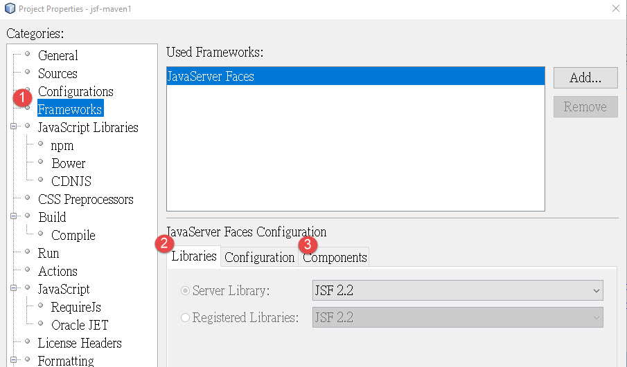

@import "../css/article_01.css"


建立 Maven 專案開發 JSF 應用程式
2018/08/02

# 目的
使用 Netbeans, 建立一個 Maven 專案, 開發 JSF 應用程式.

# 步驟

Task 1. 建立一個 Maven Web Project. (M)File > New Project
1. 在 Create Project Wizard 的 Step 1: Choose Project, 選擇: Maven category 下的 Web Application.
2. 在 Create Project Wizard 的 Step 2: Name and Location, 輸入: Project Name, Project Location, Group Id, Version 等資訊.
3. 在 Create Project Wizard 的 Step 3: 選擇 GlassFish 及 Java EE 版本. 至 8.2 版為止尚未支援 Java EE 8.

Task 2. 加入 JSF Framework 至專案中.
1. 選擇: 專案 > 選滑鼠右鍵選單 > Properties. 顯示 Project Properties 視窗.
2. 在 Project Properties 視窗, 選擇 Frameworks category > (T)Libraries, 加入 JSF 2.2. Netbeans 會為專案產生 `web.xml` 並設定需要的內容.
   
3. 選擇 Frameworks category > (T)Components, 選擇 PrimeFaces 加入專案.

完成後, 可在 `pom.xml` 的 `dependencies` section 中找到 `primefaces` 及 `javaee-web-api` 兩個 artifactID. 可以修改 `<version>` 選擇所需要使用的版本. 

```
<dependencies>
        <dependency>
            <groupId>org.primefaces</groupId>
            <artifactId>primefaces</artifactId>
            <version>6.2</version>
        </dependency>
        <dependency>
            <groupId>javax</groupId>
            <artifactId>javaee-web-api</artifactId>
            <version>8.0</version>
            <scope>provided</scope>
        </dependency>
    </dependencies>
```

# 參考資料

* [Creating New Netbeans Project without Plugin using Maven - ICEfaces - ICEfaces.org Community Wiki](http://www.icesoft.org/wiki/display/ICE/Creating+New+Netbeans+Project+without+Plugin+using+Maven)